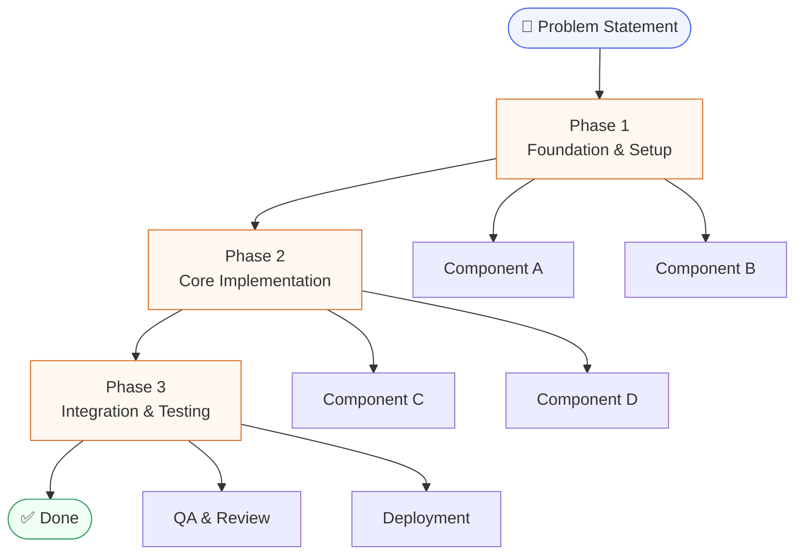

# Plan: [Feature / Project Name]

---

## 1. Problem Statement

> What problem are we solving? Who does it affect, and why does it matter?

Write a clear, plain-language description of the problem here. Avoid technical jargon. Anyone reading this — including non-technical stakeholders — should immediately understand what we are trying to fix or build.

**Example:**
> Users currently have no way to reset their password without contacting support, which leads to delays and extra workload for the support team.

---

## 2. Proposed Solution

> How are we going to solve it?

Describe the approach at a high level. Focus on *what* will be built, not *how* it will be built technically. Keep it simple and story-like.

**Example:**
> We will add a self-service password reset flow where users can request a reset link via email and update their password independently.

---

## 3. Major Components

> What are the key building blocks of this solution?

List the major parts of the system or feature that need to be built or changed. Each component should be understandable on its own.

| Component | Description |
|---|---|
| Component A | Brief description of what it does and why it is needed |
| Component B | Brief description of what it does and why it is needed |
| Component C | Brief description of what it does and why it is needed |

---

## 4. Overall Implementation Structure

> What is the high-level sequence of work?

The diagram below shows how the major components connect and the order in which work flows through the system.

> **How to read this:** Each phase builds on the previous one. Components within a phase can be worked on in parallel. Replace the placeholder names above with your actual components.

Break the implementation into clear phases or stages. Each phase should represent a meaningful chunk of progress that can be understood and tracked.

### Phase 1 — [Name]

Short description of what gets done in this phase and what the outcome is.

### Phase 2 — [Name]

Short description of what gets done in this phase and what the outcome is.

### Phase 3 — [Name]

Short description of what gets done in this phase and what the outcome is.

---

## 5. Out of Scope

> What are we explicitly NOT doing in this implementation?

List anything that might seem related but is not part of this plan. This avoids scope creep and keeps expectations clear.

- Item 1
- Item 2

---

## 6. Open Questions

> What still needs to be decided before or during implementation?

| Question | Owner | Status |
|---|---|---|
| Question here | Name | Open / Resolved |

---

*Document Owner: [Name] | Last Updated: [Date]*
