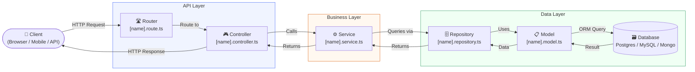
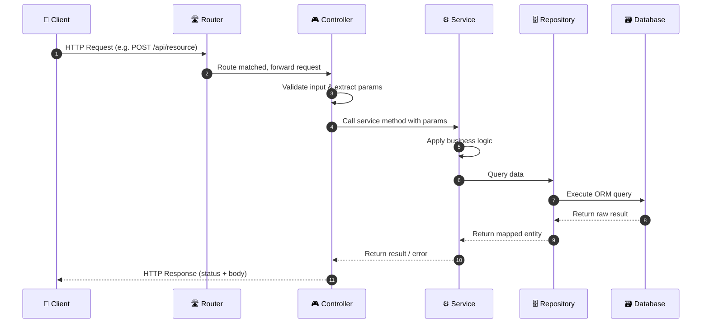

# Spec: [Feature / Project Name]

> **Related Plan:** [Link to PLAN.md]
> **Author:** [Name] | **Last Updated:** [Date] | **Status:** Draft / In Review / Approved

---

## 1. Overview

A brief technical summary of what is being built. This should connect directly to the Plan document but go one level deeper — describing the system design decisions and approach.

---

## 2. Technical Architecture

> How does this fit into the existing system?

### 2.1 System Architecture

The diagram below shows the layered architecture and how each module relates to the others.



### 2.2 Request Lifecycle (Sequence Diagram)

The diagram below shows the step-by-step journey of a single API request through the system.



---

## 3. Module Breakdown

For each major component from the Plan, describe the technical implementation in detail.

---

### 3.1 [Component A Name]

**File Location:** `src/modules/[module-name]/`

**Responsibility:** What this module is responsible for.

**Files to create / modify:**

| File | Type | Description |
|---|---|---|
| `[name].route.ts` | Route | Defines API endpoints and maps them to controller methods |
| `[name].controller.ts` | Controller | Handles HTTP request/response, status codes, input validation |
| `[name].service.ts` | Service | Contains business logic |
| `[name].repository.ts` | Repository | Handles all database interactions via ORM |
| `[name].model.ts` | Model | ORM model / schema definition |

**API Endpoints:**

| Method | Endpoint | Description | Auth Required |
|---|---|---|---|
| GET | `/api/[resource]` | Fetch all records | Yes |
| POST | `/api/[resource]` | Create a new record | Yes |
| PUT | `/api/[resource]/:id` | Update a record | Yes |
| DELETE | `/api/[resource]/:id` | Delete a record | Yes |

**Logic Flow:**

1. Request comes in through the route
2. Controller validates input and calls the service
3. Service applies business logic and calls the repository
4. Repository executes the query and returns the result
5. Controller formats the response and returns the appropriate status code

**Edge Cases / Error Handling:**

- What happens if the record is not found?
- What happens if validation fails?
- What happens if the database is unreachable?

---

### 3.2 [Component B Name]

*(Repeat the structure above for each component)*

---

## 4. Data Models

Describe any new or modified database models/schemas.

```typescript
// Example
interface [ModelName] {
  id: string;          // UUID, primary key
  fieldOne: string;    // Description of this field
  fieldTwo: number;    // Description of this field
  createdAt: Date;
  updatedAt: Date;
}
```

---

## 5. Implementation Steps

A sequential list of tasks for the developer to follow. Each step should be atomic and completable independently.

| # | Task | File(s) Affected | Estimated Time | Notes |
|---|---|---|---|---|
| 1 | Create the ORM model | `[name].model.ts` | 30 min | |
| 2 | Create the repository | `[name].repository.ts` | 1 hr | |
| 3 | Implement service logic | `[name].service.ts` | 2 hrs | Depends on step 2 |
| 4 | Build the controller | `[name].controller.ts` | 1 hr | Depends on step 3 |
| 5 | Register routes | `[name].route.ts` | 30 min | Depends on step 4 |
| 6 | Write unit tests | `[name].spec.ts` | 1.5 hrs | |
| 7 | Integration testing | — | 1 hr | |

**Total Estimated Time:** X hours / Y days

---

## 6. Dependencies & Prerequisites

- [ ] Dependency 1 (e.g. another module must be completed first)
- [ ] Dependency 2 (e.g. environment variable must be configured)
- [ ] Dependency 3 (e.g. third-party API access required)

---

## 7. Testing Plan

| Test Type | What to Test | Tool |
|---|---|---|
| Unit | Service logic, repository queries | Jest / Vitest |
| Integration | API endpoints end-to-end | Supertest |
| Manual | Edge cases, error responses | Postman / Insomnia |

---

## 8. Risks & Considerations

| Risk | Likelihood | Impact | Mitigation |
|---|---|---|---|
| Risk description | Low / Med / High | Low / Med / High | How to handle it |

---

## 9. Definition of Done

- [ ] All implementation steps completed
- [ ] Unit tests passing
- [ ] Integration tests passing
- [ ] Code reviewed and approved
- [ ] Documentation updated
- [ ] Deployed to staging and verified

---

*Spec Owner: [Name] | Last Updated: [Date]*
